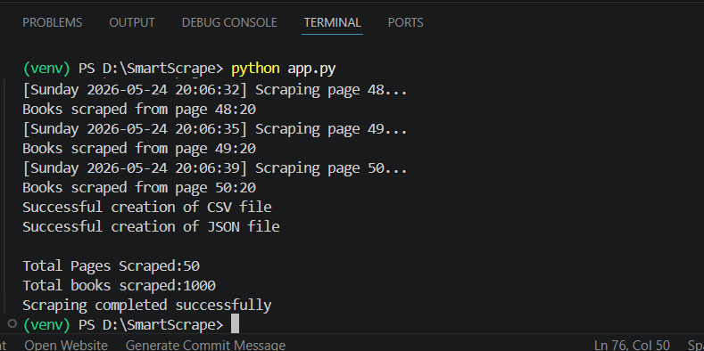
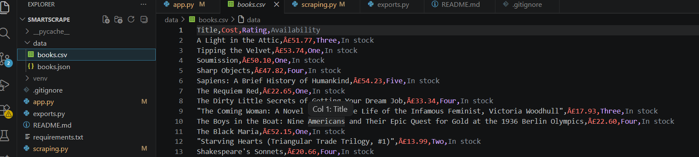
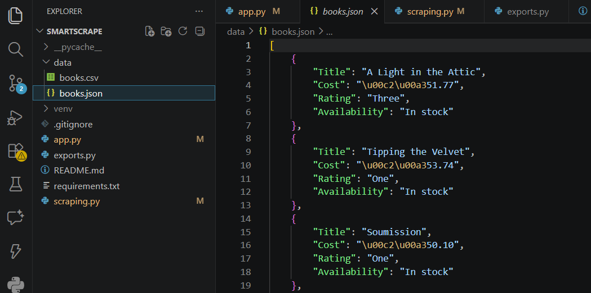

# SmartScrape
SmartScrape is a Python-based web scraping project that extracts structured book data from the Books to Scrape website using Requests and BeautifulSoup.The project demonstrates real-world web scraping workflow including pagination handling,structured data extraction, error handling,HTTP headers usage and exporting scraped data into CSV and JSON formats.

---

## Project Objective
The objective of this project is to:
- Learn how web scraping works using Python
- Understand HTML parsing and data extraction
- Handle multi-page website scraping using pagination
- Export extracted data into structured formats
- Practice real-world project organization using Git and GitHub

---

## Features
- Extracts:
  - Book titles
  - Prices
  - Ratings
  - Stock availability
- Scrapes data from all website pages using pagination
- Structured data extraction using dictionaries and lists
- Exports scraped data to:
  - CSV
  - JSON
- HTTP request handling using Requests
- HTML parsing using BeautifulSoup4
- Uses custom HTTP headers(`User-Agent`)
- Response timeout handling
- Error handling using try-except blocks
- Response status code validation
- Timestamp-based scraping logs
- Modular project structure using multiple Python files
- Git and GitHub integrated

---

## Website Used
https://books.toscrape.com/

This website is publicly available for practicing web scraping and is safe/legal to scrape for educational purposes.

---

## Technologies Used
- Python
- Requests
- BeautifulSoup4
- CSV
- JSON
- Git
- GitHub

---

## Project Structure
```plaintext
SmartScrape/
│
├── app.py
├── scraper.py
├── exporter.py
├── requirements.txt
├── README.md
│
├── data/
│   ├── books.csv
│   └── books.json
│
└── screenshots/
```

---

## Installation
```bash
pip install -r requirements.txt
```

---

## Run Project
```bash
python app.py
```

---

## Steps Performed
1. Sent HTTP requests to website pages using Requests
2. Parsed webpage HTML using BeautifulSoup
3. Extracted required book information
4. Implemented pagination to scrape all pages
5. Stored extracted data inside Python dictionaries/lists
6. Exported structured data into CSV and JSON files
7. Added exception handling and response validation
8. Added browser-like HTTP headers using User-Agent
9. Organized project into modular Python files
10. Managed project using Git and GitHub

---

## Output
The scraper successfully extracts book data from all pages and generates:
- `books.csv`
- `books.json`

Both files contain structured book information including:
- Title
- Price
- Rating
- Availability

---

## Screenshots

### Terminal Output



---

### CSV Output Preview



---

### JSON Output Preview



---

## Learning Outcomes

Through this project,I learnt:
- Fundamentals of web scraping
- HTML structure inspection using browser DevTools
- HTTP requests and response handling
- Pagination scraping logic
- Data export techniques
- Error handling in scraping workflows
- Modular Python project organization
- Git/GitHub project management workflow

---

## Future Improvements

Possible future enhancements:
- Store data in SQLite/PostgreSQL database
- Add asynchronous scraping for performance
- Add logging system
- Create command-line arguments
- Build API or dashboard for scraped data visualization